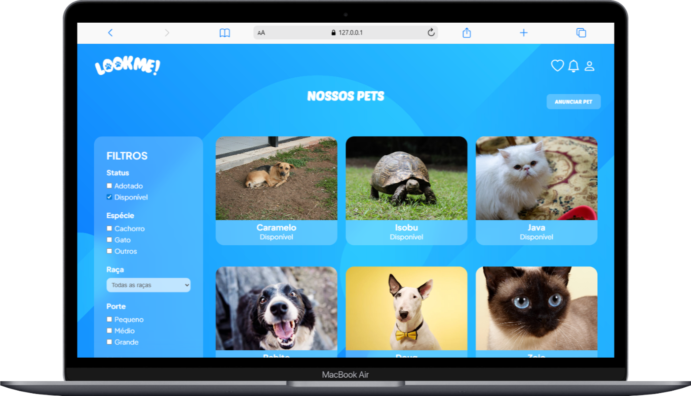

# LooK Me! - Adoção de Pets

Desenvolvido como Projeto Integrador do curso técnico em Desenvolvimento de Sistemas do SENAI, esta solução Fullstack para adoção de pets foi criada por uma equipe de três desenvolvedores com o objetivo de conectar animais a novos lares de forma eficiente. O sistema, estruturado sobre um banco de dados MySQL, apresenta operações completas de CRUD para o gerenciamento de animais e usuários. O projeto abrangeu todo o ciclo de vida de desenvolvimento, desde a prototipagem de interfaces e diagramação do banco de dados até a codificação final. O diferencial reside na aplicação rigorosa de boas práticas de engenharia de software, incluindo uma documentação robusta (TAP, RF, RNF, RN) e uma gestão ágil realizada integralmente através de Kanban, Issues e Milestones no GitHub.

## Tecnologias

### Back-end

### Front-end

### Banco de Dados

### Design e Gestão

## Autores

[Kauan Lopes](<https://www.linkedin.com/in/kauan-lopes-pereira-91b5a022a//>)
[Luana Mariana](<https://www.linkedin.com/in/luana-mariana-a78a1b30b//>)
[Marcelo Vieira](<https://www.linkedin.com/in/marcelovieirasilva/>)
